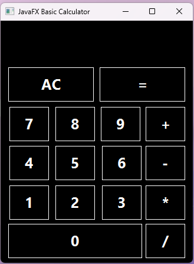

# Simple JavaFX Calculator

A basic calculator application built using JavaFX. This calculator performs basic arithmetic operations such as addition, subtraction, multiplication, and division with a user-friendly interface.

## Design

## Features

- **Basic Operations**: Perform addition (`+`), subtraction (`-`), multiplication (`*`), and division (`/`).
- **Clear Function**: Use the "AC" button to reset the calculator and clear all inputs.
- **Live Display**: The entered numbers and result are displayed in real-time.
- **Error Handling**: Handles division by zero by displaying an error message.

## Usage

### 1. Prerequisites

Ensure the following software is installed on your system:
- **Java Development Kit (JDK)**: Java 11 or higher.
- **JavaFX SDK**: If not bundled with your JDK, download and configure it manually.

### 2. Running the Application

1. Clone this repository or download the source code.
2. Open the project in your IDE (e.g., IntelliJ IDEA, Eclipse).
3. Ensure that the JavaFX SDK is properly configured in your project.
4. Run the `Main.java` class to start the application.

### 3. Using the Calculator

- **Number Input**: Click the buttons `0-9` to input numbers.
- **Operations**: Click on one of the operator buttons (`+`, `-`, `*`, `/`) to perform an operation.
- **Calculate**: Click the `=` button to compute the result of the operation.
- **Clear**: Press the `AC` button to reset the current calculation.

## UI Design (FXML)

The user interface is designed using **FXML** in the `calculator.fxml` file. The layout consists of buttons for numbers and operators, and a `Label` to display the result.
